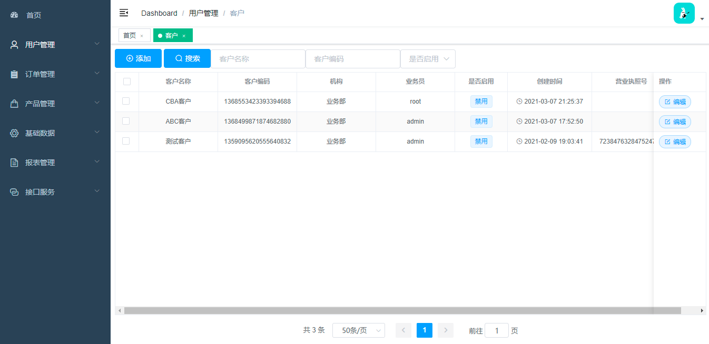
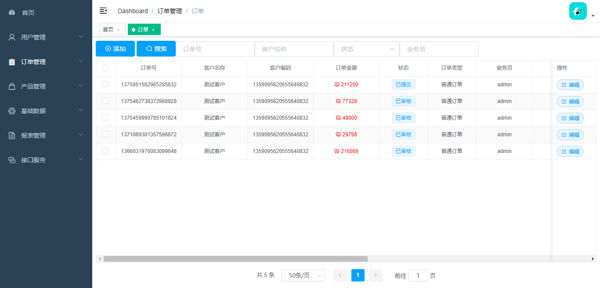
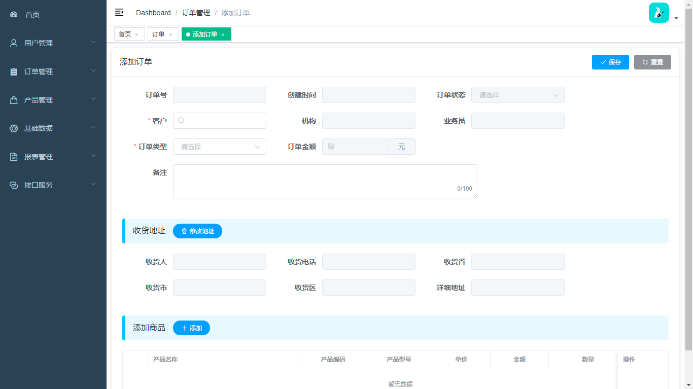
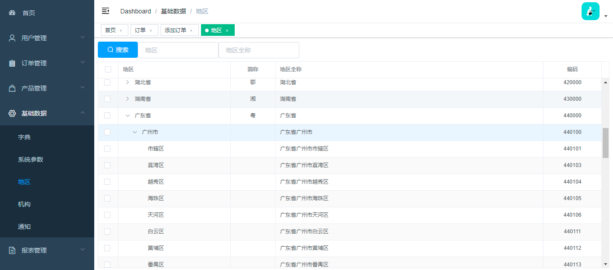

## 引言
> 此项目为个人开发项目，出于学习目的; 此项目为前端项目，基于vue-admin-template做为基础模板开发，后端：https://github.com/qjqlzwh/b2b-server

## 项目描述
> 基于B2B业务的商城系统，前后端后分离结构，初始版本具有功能：客户、订单、产品、基础数据、接口、报表、权限，后期可能会增加其他功能。


## 致谢
> 感谢vue-admin-template模板，地址：http://panjiachen.github.io/vue-admin-template

## 使用技术
```text
语言：Html, CSS, JS, ES6
框架：Vue, ElementUI
```

## 安装
```bash
# 进入项目目录
cd b2b-admin-vue

# 安装依赖
npm install

# 建议不要直接使用 cnpm 安装以来，会有各种诡异的 bug。可以通过如下操作解决 npm 下载速度慢的问题
npm install --registry=https://registry.npm.taobao.org

# 启动服务
npm run dev
```

## 目录结构
```text
# 菜单结构
src/router/index.js

```

## 项目截图



